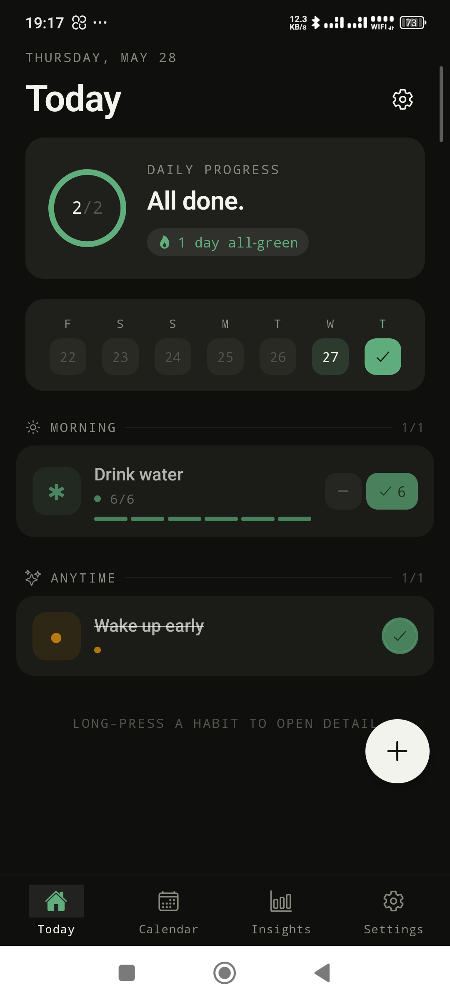
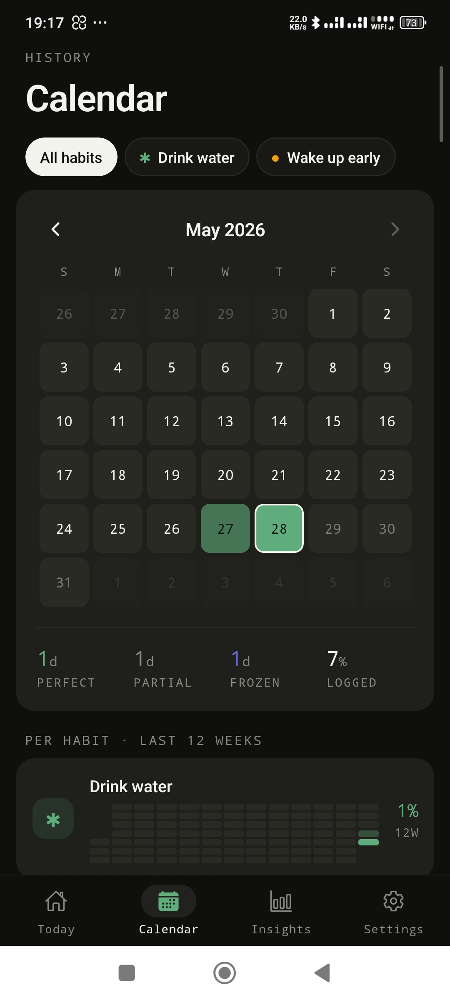
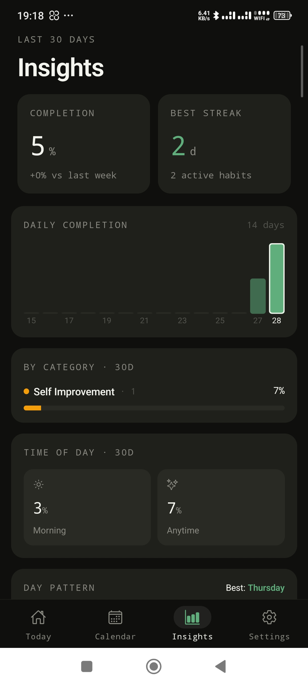
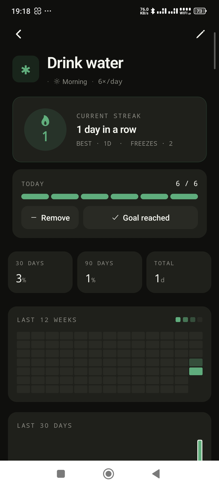
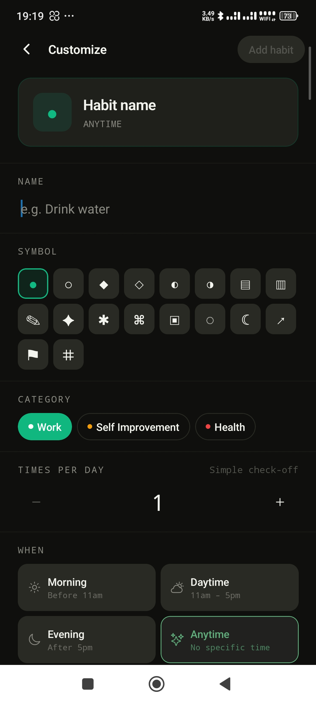
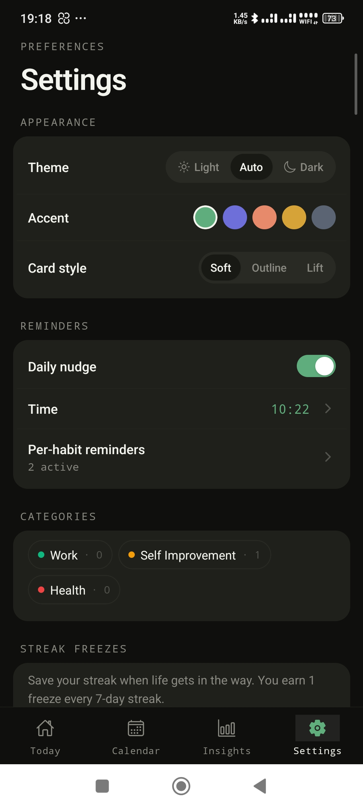

# Habit Tracker

A minimal, thoughtful habit tracker for iOS and Android built with Expo and React Native. Track daily habits, visualise streaks, and build consistency — no streak shaming, just a clearer picture of who you're becoming.

## Features

- **Today view** — progress ring, 7-day week strip, habits grouped by time of day
- **Calendar** — month heat-grid with day intensity, per-habit 12-week mini heatmaps
- **Insights** — 14-day bar chart, category & day-of-week breakdowns, per-habit stats
- **Habit templates** — 12 ready-made habits across 5 categories to get started fast
- **Streak freezes** — save a streak when life gets in the way; earn 1 freeze every 7-day streak
- **Per-habit reminders** — native push notifications with a built-in time picker
- **Daily nudge** — single global reminder with a configurable time
- **Theming** — light / dark / system modes, 5 accent colours, 3 card styles (Soft / Outline / Lift)
- **Onboarding** — 3-step flow to pick starter habits and set a reminder
- **100% offline** — all data stored locally with SQLite, no account required

## Screenshots

Drop your screen recordings or screenshots into the [`screenshots/`](./screenshots/) folder and they will appear here.

| Today | Calendar | Insights |
|---|---|---|
|  |  |  |

| Habit Detail | New Habit | Settings |
|---|---|---|
|  |  |  |

## Tech Stack

| Area | Library |
|---|---|
| Framework | [Expo](https://expo.dev) SDK 52 |
| Navigation | [Expo Router](https://expo.github.io/router) v4 (file-based) |
| Database | [expo-sqlite](https://docs.expo.dev/versions/latest/sdk/sqlite/) |
| Charts | [react-native-svg](https://github.com/software-mansion/react-native-svg) |
| Notifications | [expo-notifications](https://docs.expo.dev/versions/latest/sdk/notifications/) |
| Time picker | [@react-native-community/datetimepicker](https://github.com/react-native-community/datetimepicker) |
| Haptics | [expo-haptics](https://docs.expo.dev/versions/latest/sdk/haptics/) |
| Date utils | [date-fns](https://date-fns.org) |

## Getting Started

### Prerequisites

- [Node.js](https://nodejs.org) 18+
- [Expo CLI](https://docs.expo.dev/more/expo-cli/) — `npm install -g expo-cli`
- iOS Simulator (macOS) or Android Emulator, or the [Expo Go](https://expo.dev/go) app on a physical device

### Installation

```bash
# Clone the repository
git clone https://github.com/NadeeshaAbey/habit-tracker.git
cd habit-tracker

# Install dependencies
npm install

# Start the development server
npm start
```

Then press `i` for iOS simulator, `a` for Android emulator, or scan the QR code with Expo Go.

## Project Structure

```
habit-tracker/
├── app/
│   ├── (tabs)/               # Bottom tab screens
│   │   ├── _layout.tsx       # Custom tab bar
│   │   ├── index.tsx         # Today
│   │   ├── calendar.tsx      # Calendar & heatmaps
│   │   ├── insights.tsx      # Stats & charts
│   │   └── settings.tsx      # Preferences
│   ├── habits/
│   │   ├── [id].tsx          # Habit detail
│   │   └── new.tsx           # Create / edit habit
│   ├── onboarding.tsx        # First-launch onboarding
│   └── _layout.tsx           # Root stack + ThemeProvider
└── src/
    ├── components/
    │   └── ui.tsx            # Shared UI components
    ├── context/
    │   └── ThemeContext.tsx   # Theme state & persistence
    ├── db/
    │   ├── client.ts         # SQLite initialisation & migrations
    │   └── repositories/     # habits, categories, settings
    ├── theme/
    │   └── design.ts         # Palette, accent options, buildTheme()
    ├── types/
    │   └── index.ts          # Habit, HabitLog, Category, Period
    └── utils/
        ├── streak.ts         # Streak & completion rate helpers
        └── notifications.ts  # Push notification helpers
```

## Database Schema

The app uses a local SQLite database (`habits.db`) with four tables:

- **`habits`** — name, category, glyph symbol, target per day, period, reminders (JSON), streak freezes
- **`habit_logs`** — one row per habit per day; supports `frozen` flag for freeze days
- **`categories`** — 5 seeded categories (Health, Mind, Learning, Work, Creative) with colours
- **`settings`** — key/value store for accent, card style, theme mode, and reminder preferences

New columns are added via `ALTER TABLE` migrations wrapped in try/catch, so the database upgrades safely on first launch after an update.

## License

MIT
